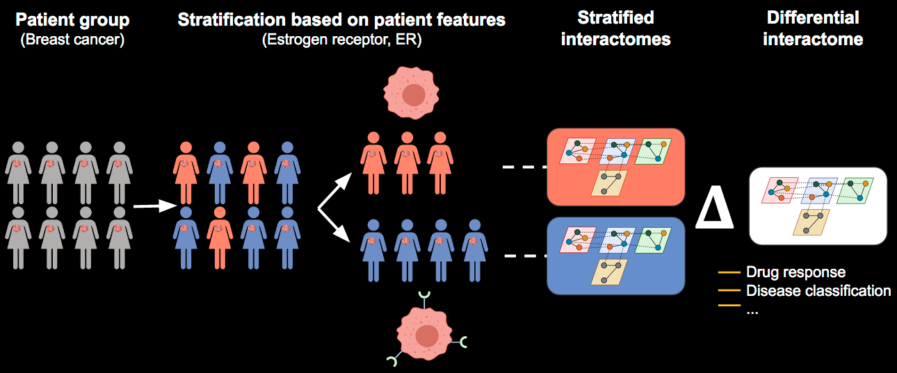
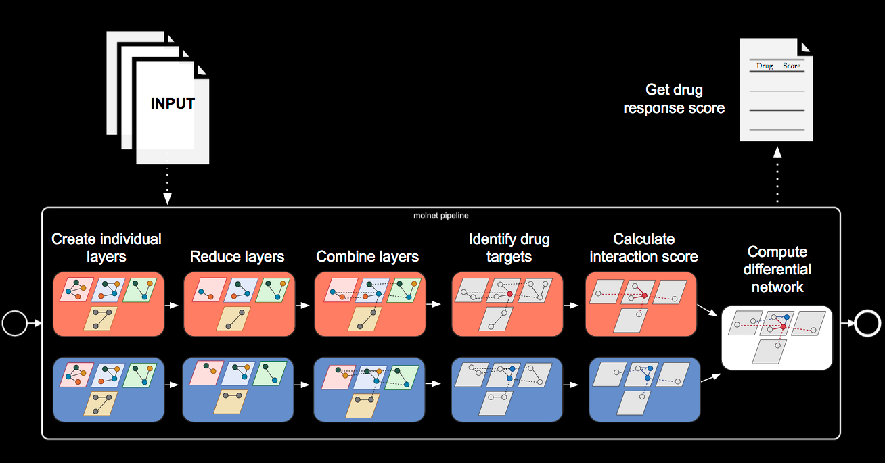

```{r, include = FALSE}
knitr::opts_chunk$set(
  collapse = TRUE,
  comment = "#>"
)
```
## Introduction

The main purpose of the pipeline is to easily and efficiently generate, reduce, and combine molecular networks from two groups or conditions (e.g., of patients) to compute a differential drug interaction score based on drug targets. This allows for improved predictions of the effect of drugs (e.g., for cancer) on two groups with different characteristics. 

## Installation

The R package `DrDimont` can be installed via CRAN or with `remotes::install_gitlab("PHiort/DrDimont")`. The requirements of the package will be installed when installing the package. The complete source code can be accessed through https://gitlab.com/PHiort/DrDimont.

After installation, load the package into your session with:
```{r setup, message=FALSE}
library(DrDimont)
```

### Installation of Python dependencies
The pipeline uses a Python script for an intermediate step. For differential drug response score computation, Python (>= 3.8) needs to be installed on the system. The `install_python_dependencies()` function of DrDimont can be used to install the Python dependencies. Depending on which Python package manager is installed on your system, the dependencies can be installed using pip (default):

```{r, echo=TRUE, warning=FALSE, eval=FALSE}
install_python_dependencies(package_manager="pip")
```

or conda: 

```{r, echo=TRUE, warning=FALSE, eval=FALSE}
install_python_dependencies(package_manager="conda")
```
With conda the python libraries will be installed in the base environment or in the currently active environment if run via command line.

Alternatively the Python dependencies can be installed manually using the `DrDimont/inst/requirements_pip.txt` or the `DrDimont/inst/requirements_conda.txt` file.


## Example Data Set Description

The following exemplary pipeline application showcases the usage of molecular breast cancer data with ER+ (Estrogen receptor-positive) patient samples as group A and ER- (Estrogen receptor-negative) as group B. A reduced exemplary data set is included within the package.

{width=100%}
[image created with biorender.com]


The breast cancer data by Krug et al. (2020) used for this tutorial is already preprocessed and only includes samples with tumor purity > 0.5 and known ER status. Metabolite data was sampled randomly to generate distributions similar to those reported, e.g., in Terunuma et al. (2014). Krug et al. (2020) published data from the Clinical Proteomic Tumor Analysis Consortium (CPTAC).

The data set contains observations from:

* 78 ER+ samples
* 34 ER- samples

|   |Number of genes, etc.|Preprocessing|Identifier|
|---|---|---|---|
|mRNA|13915|quantified mRNA expression; log2-transformed FPKM values, NAs set to -11, removed mRNAs with > 90% of zero measurements, reduced|gene name|
|Protein|5809 (ER+) and 5845 (ER-)|quantified proteomics data; normalized, standardized, removed proteins with > 20% NAs, reduced|NCBI RefSeq ID, gene name|
|phosphosites|10272 (ER+) and 11318 (ER-)|quantified phosphoproteomics data; normalized, removed phosphosites with > 20% NAs, reduced|phosphosite, gene name, NCBI RefSeq ID|
|Metabolite| 275 from 33 (ER+) and 34 (ER-) samples|randomly sampled metabolomics data; removed metabolites with > 50% NAs|biochemical name, PubChem ID, metabolon ID|

To limit run time and space requirement of the example we reduced the mRNA, protein and phosphosite data to a random set of 50 genes. The 50 genes were randomly selected from the set of genes with known drug targets from The Drug Gene Interaction Database (https://www.dgidb.org/). The metabolite data was also randomly reduced to 50 metabolites.

### Loading the data

First you load the pre-processed data. This data is included in the package and does not need to be manually loaded but can be directly accessed once `library(DrDimont)` is called.

```{r Load data}
data("mrna_data")
data("protein_data")
data("phosphosite_data")
data("metabolite_data")
data("metabolite_protein_interactions")
data("drug_gene_interactions")
```

### Transforming the data to the required input format

After loading the data, you can use formatting functions to bring the data into the required input format:

* make_layer() # Creates individual molecular layers from raw data and unique identifiers
* make_connection() # To specify connections between two individual layers
* make_drug_target() # Formats drug target interactions

#### Create individual layers data structure from the molecular data
Before running the pipeline, individual layer objects have to be created using `make_layer()`. The user should supply raw data stratified over two patient groups and unique identifiers for the molecular entities, e.g, genes. The function `make_layer()` requires these input: `name`, `data_groupA`, `data_groupB`, `identifiers_groupA` and `identifiers_groupB`. A layer should be given a unique name with the `name` argument. The `identifiers_groupA` and `identifiers_groupB` should be data frames containing one or more uniquely named columns with identifiers of the molecular entities, e.g., gene names. The raw data for `data_groupA` and `data_groupB` should be given with the samples as rows and the molecular entities (e.g, genes) as columns. The identifiers of the molecular entities need to be in the same order as the columns in the raw data. If you have only one group to analyse then set the parameters `data_groupB=NULL` and `identifiers_groupB=NULL`.


Run the code below for exemplary raw data frames:

```{r}
# Data inspection
mrna_data$groupA[1:3, 1:5]
protein_data$groupA[1:3, 1:5]
phosphosite_data$groupA[1:3, 1:5]
metabolite_data$groupA[1:3, 1:5]

```

With the code below we create the individual layers:

```{r Create layers}
# Create individual layers
mrna_layer <- make_layer(name="mrna",
                         data_groupA=t(mrna_data$groupA[,-1]),
                         data_groupB=t(mrna_data$groupB[,-1]),
                         identifiers_groupA=data.frame(gene_name=mrna_data$groupA$gene_name),
                         identifiers_groupB=data.frame(gene_name=mrna_data$groupB$gene_name))

protein_layer <- make_layer(name="protein",
                            data_groupA=t(protein_data$groupA[, c(-1,-2)]),
                            data_groupB=t(protein_data$groupB[, c(-1,-2)]),
                            identifiers_groupA=data.frame(gene_name=protein_data$groupA$gene_name, 
                                                         ref_seq=protein_data$groupA$ref_seq),
                            identifiers_groupB=data.frame(gene_name=protein_data$groupB$gene_name, 
                                                         ref_seq=protein_data$groupB$ref_seq))

phosphosite_layer <- make_layer(name="phosphosite",
                                data_groupA=t(phosphosite_data$groupA[, c(-1,-2, -3)]),
                                data_groupB=t(phosphosite_data$groupB[, c(-1,-2, -3)]),
                                identifiers_groupA=data.frame(phosphosite_data$groupA[, 1:3]),
                                identifiers_groupB=data.frame(phosphosite_data$groupB[, 1:3]))

metabolite_layer <- make_layer(name="metabolite",
                               data_groupA=t(metabolite_data$groupA[, c(-1,-2, -3)]),
                               data_groupB=t(metabolite_data$groupB[, c(-1,-2, -3)]),
                               identifiers_groupA=data.frame(metabolite_data$groupA[, 1:3]),
                               identifiers_groupB=data.frame(metabolite_data$groupB[, 1:3]))

```

Below we are creating a list of all individual layers for pipeline input:

```{r Make layers list}
all_layers <- list(mrna_layer, protein_layer, phosphosite_layer, metabolite_layer)
```

#### Create inter-layer connections data structure
The inter-layer connections need to supplied by the user with `make_connection()`. The parameters `from` and `to` have to match to a name in the previously created layers by `make_layer()`. The established connection will result in an undirected combined graph. There are two options to connect layers: (i) based on identical identifiers of entities, or (ii) based on a given interaction table. 

For (i), two layers have to have one matching column name in their identifier data frame that is passed as the parameter `connect_on`. Two entities in the different layers with the same ID therein are connected with an edge of fixed weight (indicated by the `weight` parameter, default 1).

For example:
```{r eval=FALSE}
# (i) make inter-layer connection 
make_connection(from='mrna', to='protein', connect_on='gene_name', weight=1)
```

For (ii), an interaction table containing three columns is required. Two columns should contain entity IDs that are also given in the respective identifier data frames of the two layers to be connected. One column of those should be named the same as a column name given in the identifier data frame of one layer and the second column the same for the second layer. The third column should contain the weights with which the respective entities of the two layers should be connected. 

See `data(metabolite_protein_interactions)` for an exemplary interaction table. The table contains the columns `pubchem_id` also given for the metabolite layer, `gene_name` also given for the protein layer, and `combined_score` containing the weights for the respective interactions:

```{r}
# Data inspection
metabolite_protein_interactions[1:3, ]
```

The interaction table should be passed to the `connect_on` parameter of the function `make_connection()` and the column name of the column containing the weights to the `weight` parameter. 

For example:

```{r eval=FALSE}
# (ii) make inter-layer connection 
make_connection(from='protein', to='metabolite', connect_on=metabolite_protein_interactions, weight='combined_score')
```


If you have only one layer you can skip this step and set the parameter `inter_layer_connections=NULL` later on (see: Running the complete pipeline).


Below we are creating a list of all inter-layer connections for pipeline input:
```{r Inter-layer connections}
all_inter_layer_connections = list(
    make_connection(from='mrna', to='protein', connect_on='gene_name', weight=1),
    make_connection(from='protein', to='phosphosite', connect_on='gene_name', weight=1),
    make_connection(from='protein', to='metabolite', 
                    connect_on=metabolite_protein_interactions, weight='combined_score')
)
```

#### Create drug-target interaction data structure
To run the entire pipeline, drug-target interactions are required. For that we need an interaction table mapping drugs to their targets, e.g, proteins. The table should contain two columns: one column containing the drug ids with the name `drug_name` and another column containing the drug targets with a name matching a column name in the identifier data frame of the target layer. In our example we are using a table from The Drug Gene Interaction Database providing interactions of drugs with genes. The exemplary data frame has three columns (gene_name, drug_name, drug_chembl_id), one containing the gene names also given for the target protein layer, the second containing the drug names which are used to identify the drugs and a third column containing the ChEMBL IDs of drugs which will be ignored in the pipeline.  

For example:
```{r}
# Data inspection
drug_gene_interactions[1:3, ]
```

The function `make_drug_target()` generates the required format of the drug-target interactions for the pipeline. The parameter `target_molecules` should match one of the layer names, e.g., `protein`. The data frame supplied with the parameter `interaction_table` should map drugs to their target as described above. The column in the interaction table containing the targets should be given with the `match_on` parameter, e.g, `match_on=gene_name` for `protein` as targets.


```{r Make drug-target interaction}
all_drug_target_interactions <- make_drug_target(
                                        target_molecules='protein',
                                        interaction_table=drug_gene_interactions,
                                        match_on='gene_name')
```

#### Check input data structures
When the input data structures of the individual layers, the inter-layer connections, and the drug target interactions are created they are checked automatically for validity. Additionally, the function below checks for a variety of possible input formatting errors and reports registered data set sizes (samples, entities) for the user to compare with the intended input.

```{r}
return_errors(check_input(all_layers, all_inter_layer_connections, all_drug_target_interactions))
```


## Running the complete pipeline

The pipeline can be run entirely or in individual steps. To set global pipeline options a settings list needs to be created using the `drdimont_settings()` function. This function contains default parameters that can be modified as shown below. For a detailed explanation of all possible settings and parameters please refer to the function documentation by calling `?drdimont_settings()`.

Please be aware of the python script used in one of the pipeline steps (see Requirements above). If you have installed python and the required packages via pip then you should set the `drdimont_settings()` parameter `python_executable="python"` or `python_executable="python3"` depending on your installed python version. If you have installed python and the required packages manually in a custom conda environment then set the `drdimont_settings()` parameters `conda=TRUE` and `python_executable="-n name-of-your-environment python"`. If you are using the conda base environment then you can set `python_executable="python"`.

The intermediate pipeline and drug response scores output (parameter `save_data`) is deactivated for this example (see below) but especially for large data files consider turning it on (the default). You can specify the output location of files with the `saving_path` parameter. If not specified all files will be written to the current working directory. For the this example, the data will be saved in a temporary directory. If you want to save the data elsewhere you need to change the parameter `saving_path` below. The intermediate output data includes RData-files of the correlation matrices, the individual graphs, the combined graphs, the drug target edges, the interaction score graphs, and the differential score graph. The drug response scores are saved in a tsv-file in the specified output directory if `save_data=TRUE`.

The settings list for the example (call `?drdimont_settings()` for further information on the parameters):
```{r Settings}
example_settings <- drdimont_settings(
                            handling_missing_data = list(
                                default = "pairwise.complete.obs",
                                mrna = "all.obs"
                            ),
                            reduction_method = "pickHardThreshold",
                            r_squared=list(default=0.65, metabolite=0.1),
                            cut_vector=list(default=seq(0.2, 0.65, 0.01)),
                            save_data = FALSE,
                            python_executable = "python3",
                            saving_path = tempdir())
# disable multi-threading for example run; 
# not recommended for actual data processing
WGCNA::disableWGCNAThreads()

```


To run the entire pipeline from beginning-to-end the `run_pipeline()` function can be used:

```{r Run pipeline, eval=FALSE}
run_pipeline(layers=all_layers, 
             inter_layer_connections=all_inter_layer_connections, 
             drug_target_interactions=all_drug_target_interactions, 
             settings=example_settings)
```

## Running the individual pipeline steps

The pipeline can also be used in a modular fashion. The modules then refer to the different steps:

<ol>
<li>Compute correlation matrices</li>
<li>Generate individual graphs</li>
<li>Combine graphs</li>
<li>Identifying drug targets and their edges</li>
<li>Calculate integrated interaction score</li>
<li>Generate differential graph</li>
<li>Calculate differential drug response score</li>
</ol>

{width=100%}
[image created with biorender.com]

### Step 1: Compute correlation matrices

In step one, correlation matrices are computed for the specified layers described above. `spearman` (default), `pearson`, and `kendall` can be chosen as correlation methods by setting the parameter `reduction_method` in `drdimont_settings()`. The list of layers and the settings list are passed to `compute_correlation_matrices()`. To reduce run time this example will  only analyze the first 10 genes and patients of the mRNA layer (set `layers=all_layers` in `compute_correlation_matrices()` to compute all layers):

```{r Correlation matrices, message=FALSE, results='hide'}
reduced_mrna_layer <- make_layer(name="mrna",
                           data_groupA=t(mrna_data$groupA[1:10,2:11]),
                           data_groupB=t(mrna_data$groupB[1:10,2:11]),
                           identifiers_groupA=data.frame(gene_name=mrna_data$groupA$gene_name[1:10]),
                           identifiers_groupB=data.frame(gene_name=mrna_data$groupB$gene_name[1:10]))

example_correlation_matrices <- compute_correlation_matrices(
                                            layers=list(reduced_mrna_layer), 
                                            settings=example_settings)
```

The resulting data structure `example_correlation_matrices` is a nested named list with 3 levels containing the correlation matrices and annotation data frames. The first level are `correlation_matrices` and `annotations`. The correlation matrices are separated on the second level by group (`groupA` and `groupB`) and on the third level by layer name (e.g., `mrna`, `protein`, etc.). The annotations element contains annotations for each groups and both combined at the second level (`groupA`, `groupB`, and`both`). The third level consist of named data frames, for each layers one data frame, which contain the pipeline-internal mapping of the identifier data frames of the individual layers to layer specific node IDs.

For example:
```{r}
# Data inspection
data("correlation_matrices_example")
correlation_matrices_example$annotations$groupA$protein[1:3, ]
```

### Step 2: Generate individual graphs

Next, the individual graphs are generated. In this step edge weights are established based on the correlation computation and the edges are reduced by the specified reduction method. Reduction can be done based on maximizing scale-freeness employing `WGCNA::pickHardThreshold` (`reduction_method=pickHardThreshold` in `drdimont_settings()`; default) or based on significance of the correlation (`reduction_method=p_value`).

```{r Individual graphs, message=FALSE, results='hide'}
data("correlation_matrices_example")
example_individual_graphs <- generate_individual_graphs(
                                        correlation_matrices=correlation_matrices_example, 
                                        layers=all_layers, 
                                        settings=example_settings)
```

The resulting data structure `example_individual_graphs` is a nested named list with 3 levels containing the graphs and annotation data frames. The element `graphs` contains, similar to the correlation matrices, the two groups on the second level and the graphs as iGraphs objects for each molecular layer on the third level. The `annotations` element is a copy from the `annotations` element of the `example_correlation_matrices` data (see Step 1).


### Step 3: Combine graphs

In this step, the individual graphs are combined to a single combined graph per group based on the inter-layer connections created above. The function creates the disjoint union of the individual graphs and adds inter-layer edges with the specified weight.

```{r Combine graphs}
example_combined_graphs <- generate_combined_graphs(
                                    graphs=example_individual_graphs[["graphs"]], 
                                    annotations=example_individual_graphs[["annotations"]], 
                                    inter_layer_connections=all_inter_layer_connections, 
                                    settings=example_settings)
```

The resulting data structure `example_combined_graphs` is a nested named list with 2 levels containing the combined graphs and a combined annotation data frame. The element `graphs` contains the two groups on the second level with the combined graphs as iGraphs objects. The `annotations` element consists of a data frame on the second level named `both` which contains the mapping of the identifier data frames of the individual layers to the layer specific node IDs for all layers together.

For example:
```{r}
# Data inspection
example_combined_graphs$annotations$both[1:3, ]
```


### Step 4: Identifying drug targets and their edges

Next, in order to extract the list of relevant drugs the drug targets are identified in the combined graph for each group. Here, the node IDs of the specified drug targets are found in the combined graph and the drugs are mapped to their target nodes. Additionally, edge lists are returned containing the incident edges of drug target nodes for which integrated interaction scores are computed in the next step.

```{r Drug targets and their edges}
example_drug_target_edges <- determine_drug_targets(
                                        graphs=example_combined_graphs[["graphs"]], 
                                        annotations=example_combined_graphs[["annotations"]], 
                                        drug_target_interactions=all_drug_target_interactions, 
                                        settings=example_settings)
```

The resulting data structure `example_drug_target_edges` is a nested named list with 2 levels. The first level consists of the elements `targets` and `edgelists`. The element `targets` contains the data frame `target_nodes` and the dictionary-like list `drugs_to_target_nodes`. The data frame `target_nodes` contains the node IDs of the nodes that are drug targets and TRUE/FALSE values if they are present in the graph of each group. The list `drugs_to_target_nodes` maps the drugs to the node IDs of their targets. The element `edgelists` consists of a data frame for each of the groups (`groupA` and `groupB`) which, respectively, contain the incident edges of the drug targets and their weights (columns `from`, `to` and `weight`).

### Step 5: Calculate integrated interaction score

In this step, the combined graphs for each group together with the edge list from `drug_target_edges` are used to calculate the integrated interaction scores for all edges incident to drug targets. The pipeline uses a Python script to compute the integrated interaction scores in the function `generate_interaction_score_graphs()`. The input data for the Python script (combined graphs for both groups in gml format and relevant edges lists for both groups in tsv format) are written to disk and the script is called to calculate the scores. Output files written by the Python script are two graphs in gml format containing the interaction score as an additional edge attribute called `interactionweight`. These are then loaded into R and returned in a named list containing the graphs for `groupA` and `groupB`, respectively.

<b> Attention </b>: Data exchange via files is mandatory and can take long for large data. Additionally, the interaction score computation can be slow. Therefore, do not set `max_path_length` in `drdimont_settings()` to a large value (default: 3). If `max_path_length=1` then the integrated interaction scores will be the same as the correlation-based edge weights. 

The Python script for integrated interaction score computation is parallelized using ray (https://www.ray.io/). Refer to the Ray documentation if you encounter problems with running the python script in parallel. Use the setting `int_score_mode="sequential"` in `drdimont_settings()` for forced sequential computation or `int_score_mode="ray"` for parallel computation otherwise one of the two will be automatically chosen based on the size of the data.

<b> Running Ray on a compute cluster </b>: If you want to run DrDimont on a cluster, run `ray start --head --num-cpus 12` (change number of CPUs as fit) on the command line, before starting the R session.


```{r Calculate interaction score, eval=FALSE}
example_interaction_score_graphs <- generate_interaction_score_graphs(
                                            graphs=example_combined_graphs[["graphs"]], 
                                            drug_target_edgelists=drug_targets[["edgelists"]], 
                                            settings=example_settings)
```


### Step 6: Generate differential graph

To generate a differential graph, the difference of the interaction scores between the two groups is computed by subtracting the values of the edge attributes of `groupB` from `groupA` (i.e., `groupA` - `goupB`). A single differential graph with `differential_score` and `differential_interaction_score` as edge attributes is returned. The edge attribute `differential_score` is the difference of the correlation-based edge weights and `differential_interaction_score` is the difference in integrated interaction scores. Missing edges in one of the two groups are set to zero before computing the difference. The differential integrated interaction score is set to be `NA` if the integrated interaction score was not computed in both groups, i.e., for all edges not incident to a drug target.

```{r Calculate differential score}
data("interaction_score_graphs_example")
example_differential_graph <- generate_differential_score_graph(
                                            interaction_score_graphs=interaction_score_graphs_example, 
                                            settings=example_settings)
#if interaction score graphs were computed use the following:
#example_differential_score_graph <- generate_differential_score_graph(
#                                           interaction_score_graphs=example_interaction_score_graphs, 
#                                           settings=example_settings)
```

### Step 7: Calculate differential drug response score

In the last step, the differential drug response score is calculated based on the differential graph. The score of a drug is the mean (default) or the median of all differential integrated interaction scores of the edges incident to the drug targets. Drugs that have only targets without any edges have a `NA` as differential drug response.

```{r Drug response}
example_drug_response_scores <- compute_drug_response_scores(
                                                     differential_graph=example_differential_graph,
                                                     drug_targets=example_drug_target_edges[["targets"]],
                                                     settings=example_settings)
```

The first few lines of the resulting data frame are shown below. The data frame is saved as `drug_response_score.tsv` in the specified output folder (see above). The drug response score is an indirect measure of how the strength of connectivity differs between the groups for the drug targets of the particular drug.

```{r Result Output}
head(dplyr::filter(example_drug_response_scores, !is.na(drug_response_score)))
```

## References
Full citation:

Krug et. al (2020): 

* Krug, Karsten et al. “Proteogenomic Landscape of Breast Cancer Tumorigenesis and Targeted Therapy.” Cell vol. 183,5 (2020): 1436-1456.e31. https://www.doi.org/10.1016/j.cell.2020.10.036

Terunuma et al.(2014):

* Terunuma, Atsushi et al. “MYC-driven accumulation of 2-hydroxyglutarate is associated with breast cancer prognosis.” The Journal of clinical investigation vol. 124,1 (2014): 398-412. https://www.doi.org/10.1172/JCI71180

The package `DrDimont` is an updated version of the previously published `molnet` package (https://github.com/molnet-org/molnet; https://CRAN.R-project.org/package=molnet)
